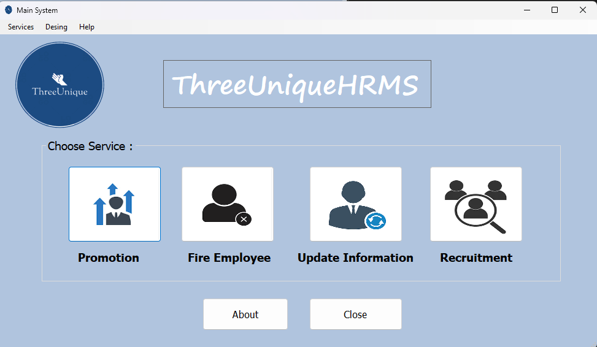

# ThreeUnique HR Management System

## Overview

ThreeUnique is a comprehensive Human Resources Management System developed as part of a university course project to demonstrate proficiency in C# and .NET Framework development. The application provides essential HR functionalities including employee recruitment, promotions, terminations, and record management.

<div align="center">
  
</div>

## Features

- **User Authentication**: Secure login system with admin credentials
- **Employee Recruitment**: Streamlined process for hiring new employees
- **Promotion Management**: Track and manage employee promotions
- **Employee Termination**: Handle employee dismissals with proper documentation
- **Record Updates**: Modify and maintain employee information
- **Database Integration**: Persistent data storage using local database
- **Customizable UI**: Change application theme colors and fonts
- **Guidelines & Help**: Built-in documentation and company information

## Technologies Used

- **Framework**: .NET Framework 4.8
- **Language**: C# (Windows Forms)
- **Database**: Local database with ADO.NET
- **IDE**: Visual Studio 2022

## Getting Started

### Prerequisites

- Windows Operating System
- .NET Framework 4.8 or higher
- Visual Studio 2019 or later (recommended)

### Installation

1. Clone the repository:
   ```bash
   git clone https://github.com/oosQ/ThreeUnique-HRSystem.git
   ```

2. Open the solution file `ProjectDemo.sln` in Visual Studio

3. Build the solution:
   - Press `Ctrl + Shift + B` or
   - Navigate to **Build → Build Solution**

4. Run the application:
   - Press `F5` to start debugging

### Default Login Credentials

- **Username**: `admin`
- **Password**: `root`

## Project Structure

```
ProjectDemo/
├── Form1.cs                    # Main application form
├── LoginForm.cs                # Authentication interface
├── Recruitment.cs              # Employee hiring module
├── Promotion.cs                # Employee promotion module
├── FiredEmp.cs                 # Employee termination module
├── UpdateForm.cs               # Employee record updates
├── AboutForm.cs                # Application information
├── Guideline.cs                # User guidelines
├── Resources/                  # Application images and icons
└── ThreeUniqueDataBaseDataSet  # Database schema and adapters
```

## Academic Context

This project was developed as part of a university course curriculum to learn and demonstrate:
- Windows Forms application development
- Database connectivity and data management
- Object-oriented programming principles in C#
- User interface design and user experience
- Software development best practices

## License

This project is an academic assignment and is provided as-is for educational purposes.

<div align="center">
  <sub>Built with ❤️ for learning C# and .NET Framework</sub>
</div>
